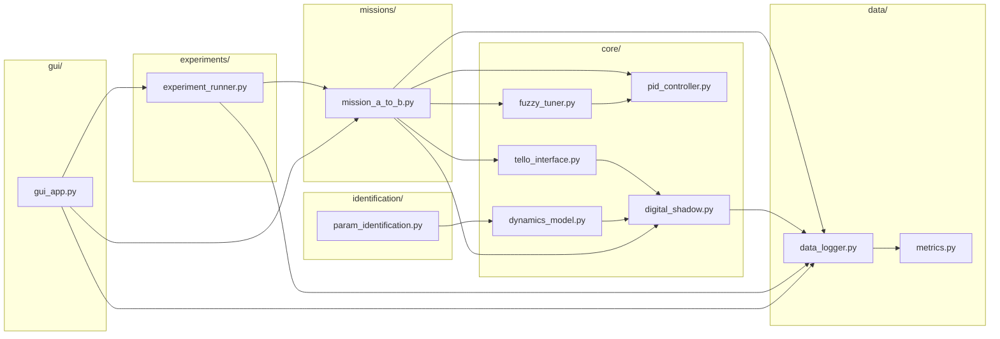

# Especificación Técnica de Desarrollo
## Sistema de Control Fuzzy Self-Tuning PID con Validación por Sombra Digital para Dron Educativo

**Propósito de este documento:** especificar con suficiente detalle técnico el sistema de software a construir, de forma que una IA de programación (o un desarrollador) pueda implementarlo sin necesidad de inferir decisiones de diseño no explícitas aquí. Donde una decisión queda abierta, se indica explícitamente como tal.

---

## 0. Contexto del proyecto (por qué se construye esto)

Este software es la infraestructura experimental de una investigación doctoral que compara dos controladores de vuelo —un PID clásico y un **Fuzzy Self-Tuning PID**— sobre un dron educativo de bajo costo (DJI Tello EDU), usando una **sombra digital** (modelo matemático simplificado que corre en paralelo al vuelo real) como herramienta de validación cuantitativa y como indicador normalizado de perturbación. La pregunta de investigación es:

> ¿En qué medida un controlador Fuzzy Self-Tuning PID, validado mediante una sombra digital de bajo costo, mejora el desempeño de vuelo de un dron educativo en un perfil de velocidad punto A→B, frente a un PID clásico, bajo escenarios de vuelo controlado, con viento natural y con perturbación artificial?

El software NO es el objeto de estudio en sí mismo — es el instrumento que permite generar los datos con los que se responde esa pregunta. Cualquier decisión de implementación debe priorizar: (1) fidelidad y trazabilidad de los datos generados, (2) reproducibilidad exacta de cada vuelo, (3) separación clara entre lógica de control y lógica de interfaz.

**Restricción de plataforma que condiciona todo el diseño:** el DJI Tello EDU no tiene GPS ni posición absoluta (salvo sobre *mission pads*, disponibles solo en SDK 2.0), y su telemetría llega a ~10 Hz vía UDP. Por lo tanto, **la variable controlada es la velocidad lineal de avance (`vgx`), no la posición**. La posición vía mission pad se usa únicamente como referencia de validación cruzada en el escenario controlado, nunca como señal de control.

---

## 1. Glosario técnico

| Término | Significado en este proyecto |
|---|---|
| Sombra digital (*digital shadow*) | Modelo dinámico que corre en paralelo al vuelo real, alimentado por los mismos comandos de control, sin retroalimentar al sistema físico (flujo de datos unidireccional real → virtual) |
| FOPDT | *First Order Plus Dead Time* — modelo dinámico de primer orden con tiempo muerto: `v(s)/u(s) = K·e^(-Ls)/(τs+1)` |
| Fuzzy Self-Tuning PID | Controlador PID cuyas ganancias (Kp, Ki, Kd) se ajustan en tiempo real mediante un sistema de inferencia difusa (FIS), en función del error y su derivada |
| FIS | *Fuzzy Inference System* — en este proyecto, tipo Mamdani |
| `rc control` | Comando del SDK Tello que envía velocidades continuas por eje (no coordenadas de destino) |
| Mission pad | Marcador visual reconocido por el Tello (SDK 2.0) que provee posición relativa `x, y, z` — solo disponible cuando el dron lo tiene en campo de visión |
| Residuo de sombra | `vgx_real − vgx_shadow` en cada instante; se usa como indicador normalizado de la magnitud de perturbación sufrida en un vuelo dado |
| Celda experimental | Combinación única de (controlador, escenario); hay 6 celdas (2×3) |

---

## 2. Resumen funcional del sistema

El sistema debe permitir, de principio a fin:

1. Identificar los parámetros del modelo FOPDT del dron mediante vuelos de calibración.
2. Sintonizar y congelar un controlador PID clásico sobre ese modelo.
3. Ejecutar vuelos de un perfil de velocidad A→B con el PID clásico o con el Fuzzy Self-Tuning PID, en cualquiera de los tres escenarios de perturbación.
4. Correr la sombra digital en paralelo a cada vuelo real, registrando ambas señales.
5. Registrar toda la telemetría, metadatos y señales de control de cada vuelo en un dataset único y acumulativo.
6. Calcular automáticamente el conjunto completo de métricas de desempeño y de fidelidad de la sombra.
7. Orquestar campañas de vuelos por lotes según un diseño experimental por bloques aleatorizados.
8. Ofrecer una interfaz para configurar, lanzar y monitorear vuelos en tiempo real, con parada de emergencia.

---

## 3. Requerimientos funcionales (detallados)

### RF1 — Ejecución de perfil de velocidad A→B
- El sistema envía comandos `rc` continuos para alcanzar y mantener un setpoint de velocidad de avance (`vgx`) durante una **duración fija configurable** (no hasta alcanzar una posición).
- Al finalizar la duración, el sistema debe llevar el dron a velocidad cero de forma controlada (no un corte abrupto de comando).
- En el escenario controlado, si hay mission pad visible en A y B, el sistema registra la posición relativa reportada para validación cruzada — esto es un registro pasivo, no altera el lazo de control.

### RF2 — Controlador PID clásico (línea base)
- PID por eje (inicialmente solo eje de avance, dado el alcance de la misión), con Kp, Ki, Kd configurables desde archivo de configuración.
- Las ganancias se sintonizan una vez (offline, sobre el modelo FOPDT identificado) y se **congelan**: el sistema no debe permitir que cambien durante una campaña sin una acción explícita de reconfiguración.
- Debe incluir anti-windup en el término integral (saturación de la salida del controlador a los límites físicos de `rc control`, [-100, 100]).

### RF3 — Controlador Fuzzy Self-Tuning PID
- Un FIS Mamdani con:
  - **Entradas:** error de velocidad `e = v_setpoint − v_real`, y su derivada `Δe` (aproximada por diferencia finita entre muestras consecutivas).
  - **Salidas:** `ΔKp`, `ΔKi`, `ΔKd`, cada una normalizada en `[-1, 1]` y escalada a `±25%` sobre la ganancia base congelada del PID (RF2).
- Las ganancias efectivas en cada instante son: `Kp_efectivo = Kp_base · (1 + ΔKp)`, análogo para Ki y Kd.
- El motor de inferencia se implementa con `scikit-fuzzy` (no construcción manual).
- Los límites de las funciones de membresía y la base de reglas se cargan desde un archivo de configuración editable, no hardcodeados (ver Sección 8).

### RF4 — Registro de telemetría
El sistema debe registrar, en cada muestra de tiempo, al menos: velocidad reportada (`vgx`, `vgy`, `vgz`), actitud (`pitch`, `roll`, `yaw`), altura (`tof`, `h`), batería (`bat`), aceleraciones (`agx`, `agy`, `agz`), señal de control enviada, ganancias efectivas del controlador activo, y posición de mission pad cuando esté disponible. Ver esquema completo en Sección 7.

### RF5 — Sombra digital (simulación paralela)
- Implementa el modelo FOPDT (Sección 9) alimentado por la misma señal de control enviada al dron real, en cada ciclo del lazo de control.
- Corre de forma sincronizada (mismo `Ts` que el lazo de control real) — ver RNF1.
- Calcula y registra en cada muestra: `vgx_shadow` y el residuo `vgx_real − vgx_shadow`.
- No debe introducir retraso perceptible al lazo de control real (RNF1): su cómputo debe completarse dentro del mismo período de muestreo.

### RF6 — Gestión de escenarios
- El operador selecciona el escenario activo antes de cada vuelo: `controlado`, `viento_natural`, `perturbacion_artificial`.
- Para `viento_natural`, el sistema exige capturar la velocidad de viento medida antes de habilitar el despegue; **si el valor ingresado es mayor a 5 m/s, el sistema debe bloquear el despegue** y mostrar advertencia (criterio operativo del diseño experimental).
- El escenario activo queda registrado como metadato en cada muestra del vuelo.

### RF7 — Interfaz de usuario
Ver especificación completa en Sección 10.

### RF8 — Identificación de parámetros dinámicos
- Módulo independiente del resto del sistema (no depende de `mission_a_to_b.py` ni de los controladores).
- Ejecuta una secuencia de señales de prueba (escalón y barrido senoidal) sobre el canal `rc` de avance, registrando `vgx` a la tasa disponible.
- Ajusta `K`, `L`, `τ` del modelo FOPDT contra los datos registrados (método de ajuste no lineal, p. ej. mínimos cuadrados).
- Produce un reporte de bondad de ajuste (p. ej. R², y gráfico de respuesta real vs. modelo ajustado).

### RF9 — Cálculo de métricas
Sobre cada vuelo (o conjunto de vuelos de una celda), calcular:

| Métrica | Definición operativa |
|---|---|
| RMSE, MAE | Sobre `vgx_real` vs. `v_setpoint` |
| Tiempo de asentamiento | Tiempo hasta que `vgx_real` entra y permanece en ±5% (configurable) del setpoint |
| Tiempo de subida | Tiempo del 10% al 90% del setpoint |
| Sobreimpulso máximo | `(max(vgx_real) − v_setpoint) / v_setpoint`, si aplica |
| ISE, IAE, ITAE | Integrales del error al cuadrado, absoluto, y absoluto ponderado por tiempo |
| Error en estado estacionario | Promedio del error en el tramo final estable del vuelo |
| Esfuerzo de control | Varianza de la señal de control; número de cambios de signo/frecuencia de conmutación |
| Fidelidad de la sombra | RMSE entre `vgx_real` y `vgx_shadow` |
| Robustez relativa | Diferencia de la métrica principal entre escenario controlado y perturbado, normalizada por el residuo promedio de la sombra en ese vuelo |

### RF10 — Orquestación de campañas
- El sistema debe ejecutar una secuencia de vuelos según el diseño por bloques aleatorizados: cada **sesión** cubre un escenario, con ambos controladores ejecutados en **orden aleatorio** dentro de la sesión, repitiendo hasta completar 25-30 pares por celda (ajustable según el resultado del análisis de potencia — ver Nota Abierta 1).
- Debe registrar el número de sesión, el orden de ejecución, y el número de repetición acumulado por celda.
- Debe permitir pausar/reanudar una campaña (p. ej. por carga de batería) sin perder el estado de qué repeticiones ya se completaron.

### RF11 — Reportes y visualización
- Gráfico de velocidad real vs. sombra digital por vuelo.
- Gráfico de trayectoria (mission pad) real vs. simulada, solo para vuelos del escenario controlado donde haya datos de mission pad.
- Tabla comparativa de métricas por celda (controlador × escenario).

### RF12 — Exportación de datos
- Exportar el dataset acumulado (o un subconjunto filtrado por campaña/fecha) en CSV, con el esquema de la Sección 7, listo para ser leído por un script de análisis estadístico separado (Wilcoxon + Holm, fuera del alcance de este software).

---

## 4. Requerimientos no funcionales (detallados)

| ID | Requerimiento |
|---|---|
| RNF1 | El lazo de control y la sombra digital deben ejecutarse a una cadencia fija `Ts` (a determinar empíricamente en la fase de preparación, límite superior dado por la tasa de telemetría del SDK, ~10 Hz). El cómputo de un ciclo completo (lectura de telemetría + control + sombra + registro) debe tomar menos que `Ts`. |
| RNF2 | Persistencia incremental: cada muestra se escribe a disco (o a un buffer con flush periódico) inmediatamente, no solo al final del vuelo. Ante una desconexión, los datos ya registrados deben quedar íntegros. |
| RNF3 | Toda configuración usada en un vuelo (ganancias, reglas difusas, parámetros FOPDT, escenario, duración) debe registrarse junto con los datos de ese vuelo — reconstruible al 100%. |
| RNF4 | **Separación estricta de responsabilidades:** ningún módulo de control, simulación o registro de datos debe importar o depender del módulo de interfaz gráfica. La GUI solo invoca funciones/métodos expuestos por esos módulos y se suscribe a sus salidas; nunca al revés. |
| RNF5 | Entorno reproducible: `requirements.txt` o `pyproject.toml` con versiones fijadas; sin dependencias fuera del ecosistema Python estándar más allá del SDK del Tello. |
| RNF6 | Uso de Git con commits por unidad funcional completa (no commits masivos al final de cada fase). |
| RNF7 | Un operador debe poder configurar y lanzar un vuelo completo (controlador + escenario) en menos de un minuto de interacción con la interfaz. |
| RNF8 | **Seguridad operativa** — el sistema debe ejecutar aterrizaje de emergencia automático si: (a) la batería reportada cae por debajo de un umbral configurable (sugerido 15%), (b) no se recibe telemetría por más de N segundos configurables (sugerido 2s), (c) el operador presiona un control de parada manual siempre visible en la interfaz. |
| RNF9 | El formato de almacenamiento (CSV único acumulativo, o particionado por campaña) debe soportar cientos de vuelos sin degradar significativamente el tiempo de lectura para análisis. |
| RNF10 | **Validez estadística** — el número de repeticiones por celda usado por `experiment_runner.py` debe ser un parámetro de configuración, no un valor fijo en código, porque depende del resultado del análisis de potencia (Nota Abierta 1). |

---

## 5. Arquitectura del sistema



**Principio de diseño no negociable:** las flechas hacia `APP` (GUI) van en un solo sentido — la GUI llama, no es llamada. Ningún módulo dentro de `core/`, `missions/`, `data/`, `identification/` o `experiments/` debe importar nada de `gui/`.

### 5.1 Especificación por módulo

#### `tello_interface.py`
- **Responsabilidad:** única capa que habla directamente con el SDK del Tello (`djitellopy` o llamadas UDP directas).
- **Debe exponer:** conexión/desconexión, lectura de telemetría más reciente (no bloqueante o con timeout corto), envío de comando `rc`, comando de aterrizaje de emergencia, y un callback/evento para notificar pérdida de conexión.
- **Manejo de errores:** cualquier excepción del SDK debe capturarse aquí y traducirse a un estado interno (`conectado` / `desconectado` / `error`), nunca dejar propagar una excepción cruda hacia `mission_a_to_b.py`.

#### `pid_controller.py`
- **Responsabilidad:** cálculo de la señal de control PID clásica, dado el error actual y el estado interno del controlador (integral acumulada, error anterior).
- **Debe exponer:** un método de "paso" que recibe error y `Ts`, devuelve la señal de control, y actualiza su estado interno; un método de reinicio de estado (para el inicio de cada vuelo); parámetros Kp/Ki/Kd cargables desde configuración.
- **Debe implementar:** anti-windup por saturación (clamping) del término integral cuando la salida total excede los límites de `rc control`.

#### `fuzzy_tuner.py`
- **Responsabilidad:** dado el error y su derivada, devolver `ΔKp, ΔKi, ΔKd` normalizados, vía `scikit-fuzzy`.
- **Debe exponer:** construcción del sistema de inferencia a partir del archivo `fuzzy_rules.json` (Sección 8.2) — es decir, el sistema difuso no debe estar hardcodeado en el módulo, sino ensamblado en tiempo de ejecución desde la configuración.
- **Debe usarse en conjunto con `pid_controller.py`:** este módulo no reemplaza al PID, solo produce los multiplicadores de ganancia que `pid_controller.py` aplica antes de calcular la salida.

#### `dynamics_model.py`
- **Responsabilidad:** implementar el modelo FOPDT (ecuaciones en Sección 9) como una función de simulación de un paso, dado el historial reciente de la señal de control y el estado anterior del modelo.
- **Debe exponer:** carga de parámetros `K, L, τ` desde `dynamics_params.json`; un método de "paso de simulación" análogo en forma al de `pid_controller.py`, para poder ejecutarse en el mismo ciclo del lazo de control.

#### `digital_shadow.py`
- **Responsabilidad:** orquestar `dynamics_model.py` en paralelo a la ejecución real, alimentándolo con la misma señal de control que recibe el dron real en cada ciclo, y calcular el residuo.
- **Debe exponer:** un método de "paso" que se invoca una vez por ciclo del lazo de control (mismo `Ts`), después de que se conoce la señal de control real de ese ciclo.

#### `mission_a_to_b.py`
- **Responsabilidad:** orquestar el lazo de control completo de un vuelo: define el setpoint de velocidad, la duración, invoca en cada ciclo a `tello_interface.py` (leer telemetría, enviar comando), al controlador activo (PID o Fuzzy Self-Tuning), a `digital_shadow.py`, y a `data_logger.py`.
- **Debe exponer:** una función/método que reciba la configuración del vuelo (controlador, escenario, duración, setpoint) y ejecute el vuelo completo de inicio a fin, incluyendo el descenso controlado de velocidad al finalizar.
- **Debe integrar la lógica de seguridad (RNF8)** como parte de su bucle principal, no delegada a la GUI.
- En escenario controlado, debe registrar pasivamente la posición del mission pad si está disponible, sin usarla en el cálculo de control.

#### `data_logger.py`
- **Responsabilidad:** escritura incremental del dataset (ver esquema Sección 7) — un registro por muestra de tiempo, con flush periódico a disco.
- **Debe exponer:** apertura de un nuevo registro de vuelo (con metadatos: `flight_id`, controlador, escenario, configuración completa serializada), método para agregar una muestra, y cierre del registro.

#### `metrics.py`
- **Responsabilidad:** calcular, a partir del dataset de uno o varios vuelos, todas las métricas de la tabla RF9.
- **Debe exponer:** funciones puras (sin estado) que reciban una serie de tiempo (o un DataFrame de un vuelo) y devuelvan un diccionario o `DataFrame` con las métricas calculadas, para poder probarse de forma aislada (RNF de testabilidad).

#### `param_identification.py`
- **Responsabilidad:** generar las señales de prueba (escalón, barrido senoidal), ejecutar el vuelo de calibración usando `tello_interface.py` directamente (sin pasar por `mission_a_to_b.py`, ya que no hay setpoint de misión aquí), y ajustar `K, L, τ` contra los datos registrados.
- **Debe exponer:** función de ejecución del protocolo de calibración, y función de ajuste de parámetros (independiente, para poder re-ajustar sobre datos ya grabados sin volver a volar).

#### `experiment_runner.py`
- **Responsabilidad:** orquestar la campaña completa: dado el diseño experimental (número de repeticiones por celda, orden aleatorizado dentro de sesión), invocar `mission_a_to_b.py` repetidamente con la configuración correspondiente a cada vuelo, y llevar el registro de qué repeticiones se han completado.
- **Debe exponer:** estado de avance de la campaña (para que la GUI lo muestre), capacidad de pausar/reanudar sin perder el progreso.

#### `gui_app.py`
- Ver Sección 10. Solo debe orquestar llamadas a los módulos anteriores y mostrar sus resultados; no debe contener lógica de control, simulación, ni cálculo de métricas.

---

## 6. Convenciones generales de desarrollo

- Nombres de archivos, módulos, clases y funciones en **inglés**; comentarios, docstrings y mensajes de interfaz en **español**.
- Toda constante de diseño (umbrales, límites, Hz, rangos de membresía difusa) debe vivir en un archivo de configuración, nunca hardcodeada dentro de la lógica.
- Cada módulo de `core/`, `data/`, `identification/` debe ser importable y ejecutable de forma aislada (con datos de prueba) sin necesitar conexión real al dron ni a la GUI — esto es lo que permite las pruebas unitarias de la Sección 12.

---

## 7. Esquema del dataset

Una fila por muestra de tiempo. Formato CSV, un único archivo acumulativo (o particionado por campaña, a decidir en Fase 0).

| Columna | Tipo | Descripción |
|---|---|---|
| `flight_id` | string | Identificador único del vuelo (UUID o timestamp de inicio) |
| `session_id` | string | Identificador de la sesión experimental (agrupa vuelos de un mismo bloque) |
| `timestamp` | datetime | Marca de tiempo absoluta de la muestra |
| `t_rel_s` | float | Tiempo relativo desde el inicio del vuelo, en segundos |
| `controller_type` | string | `pid` \| `fuzzy_self_tuning` |
| `scenario` | string | `controlado` \| `viento_natural` \| `perturbacion_artificial` |
| `repetition_number` | int | Número de repetición dentro de la celda (controlador × escenario) |
| `setpoint_vgx` | float | Velocidad de avance deseada |
| `vgx_real` | float | Velocidad de avance reportada por telemetría |
| `vgx_shadow` | float | Velocidad de avance simulada por la sombra digital |
| `shadow_residual` | float | `vgx_real − vgx_shadow` |
| `control_signal` | float | Comando `rc` enviado en ese ciclo |
| `kp_effective`, `ki_effective`, `kd_effective` | float | Ganancias efectivas del controlador en ese instante (iguales a las base si es PID clásico) |
| `pitch`, `roll`, `yaw` | float | Actitud reportada |
| `tof`, `h` | float | Altura (sensor ToF y barométrico) |
| `bat` | float | Porcentaje de batería reportado |
| `agx`, `agy`, `agz` | float | Aceleraciones reportadas |
| `mission_pad_x`, `mission_pad_y` | float (nullable) | Posición relativa a mission pad, si visible; vacío si no disponible |
| `wind_speed_measured` | float (nullable) | Solo para escenario `viento_natural`, capturado antes del vuelo |
| `battery_pct_start` | float | Porcentaje de batería al inicio del vuelo (metadato, constante dentro del vuelo) |

---

## 8. Archivos de configuración

### 8.1 `dynamics_params.json`
```json
{
  "K": 0.0,
  "L": 0.0,
  "tau": 0.0,
  "identified_on": "YYYY-MM-DD",
  "goodness_of_fit_r2": 0.0,
  "identification_signals": ["step", "sine_sweep"]
}
```

### 8.2 `fuzzy_rules.json`
```json
{
  "inputs": {
    "error": {"universe": [-1.0, 1.0], "terms": ["NB", "NS", "Z", "PS", "PB"]},
    "delta_error": {"universe": [-1.0, 1.0], "terms": ["NB", "NS", "Z", "PS", "PB"]}
  },
  "outputs": {
    "delta_kp": {"universe": [-1.0, 1.0], "terms": ["NB", "NS", "Z", "PS", "PB"]},
    "delta_ki": {"universe": [-1.0, 1.0], "terms": ["NB", "NS", "Z", "PS", "PB"]},
    "delta_kd": {"universe": [-1.0, 1.0], "terms": ["NB", "NS", "Z", "PS", "PB"]}
  },
  "membership_function_type": "triangular",
  "defuzzification_method": "centroid",
  "output_scaling_pct": 0.25,
  "rules": "ver 8.3 — matriz de reglas, punto de partida sugerido"
}
```

### 8.3 Base de reglas sugerida (punto de partida, a calibrar en Fase 4)

Patrón heurístico estándar de sintonización difusa de ganancias (aumentar `ΔKp` cuando el error es grande para reaccionar rápido, reducirlo cerca de cero para evitar oscilación; comportamiento de `ΔKd` complementario para amortiguar):

| error \ Δerror | NB | NS | Z | PS | PB |
|---|---|---|---|---|---|
| **NB** | PB | PB | PM | PS | Z |
| **NS** | PB | PM | PS | Z | NS |
| **Z** | PM | PS | Z | NS | NM |
| **PS** | PS | Z | NS | NM | NB |
| **PB** | Z | NS | NM | NB | NB |

*(Tabla para `ΔKp`; `ΔKi` y `ΔKd` requieren su propia matriz, típicamente con patrones inversos/complementarios entre sí. Esta tabla es un punto de partida razonable tomado de la práctica estándar de gain-scheduling difuso, no un resultado validado — debe ajustarse empíricamente en Fase 4 con datos reales del Tello.)*

### 8.4 `flight_config.json`
```json
{
  "controller": "pid",
  "scenario": "controlado",
  "setpoint_vgx": 0.0,
  "mission_duration_s": 0.0,
  "sampling_rate_hz": 0.0,
  "pid_gains": {"kp": 0.0, "ki": 0.0, "kd": 0.0},
  "safety_limits": {
    "battery_min_pct": 15,
    "telemetry_timeout_s": 2.0
  }
}
```

---

## 9. Especificación matemática del modelo dinámico (sombra digital)

**Modelo continuo:**

```
V(s) / U(s) = K · e^(−L·s) / (τ·s + 1)
```

donde `V(s)` es la velocidad de avance, `U(s)` la señal de control, `K` la ganancia estática, `τ` la constante de tiempo, `L` el tiempo muerto (retardo).

**Discretización recomendada** (para simular con tiempo de muestreo fijo `Ts`, coherente con RNF1), usando retención de orden cero (ZOH):

```
a = exp(−Ts / τ)
N_d = round(L / Ts)     # retardo expresado en número de muestras

v[k] = a · v[k−1] + K · (1 − a) · u[k − N_d]
```

- `u[k − N_d]` requiere mantener un buffer circular de las últimas `N_d` señales de control enviadas.
- Alternativa más simple (Euler explícito), aceptable si `Ts << τ`: `v[k] = v[k-1] + (Ts/τ)·(K·u[k−N_d] − v[k−1])`. Se recomienda la forma ZOH por mejor comportamiento numérico si `Ts` no es mucho menor que `τ`.

**Ajuste de parámetros (`param_identification.py`):** ajustar `K, L, τ` contra la respuesta real registrada, minimizando el error entre la salida del modelo (con esos parámetros) y `vgx` real, para las señales de prueba de escalón y barrido senoidal. Método sugerido: optimización no lineal de mínimos cuadrados (p. ej. `scipy.optimize.curve_fit` o `least_squares`), no un método de dos puntos simplificado, dado que se dispone de series de tiempo completas.

---

## 10. Especificación de la interfaz gráfica

*(Framework a definir en Fase 0 — Tkinter/CustomTkinter según la experiencia previa del proyecto; esta especificación es agnóstica al framework.)*

### Pantalla 1 — Configuración
- Selector de controlador (PID / Fuzzy Self-Tuning).
- Selector de escenario (controlado / viento natural / perturbación artificial).
- Si escenario = viento natural: campo obligatorio de velocidad de viento medida, con bloqueo de despegue si > 5 m/s.
- Campo de duración de vuelo, setpoint de velocidad.
- Visualización (solo lectura) de las ganancias PID congeladas y, si aplica, de la configuración difusa cargada.
- Botón "Conectar dron" con indicador de estado de conexión y batería actual.

### Pantalla 2 — Vuelo / monitor en tiempo real
- Gráfico en tiempo real: `vgx_real` vs. `vgx_shadow` (actualización a la cadencia `Ts`).
- Si escenario controlado y mission pad visible: gráfico secundario de trayectoria real vs. simulada.
- Indicadores: batería actual, estado de conexión, controlador activo, escenario activo, tiempo transcurrido.
- **Botón de parada de emergencia siempre visible y accesible** (RNF8).

### Pantalla 3 — Historial / campaña
- Tabla de vuelos registrados (filtrable por controlador, escenario, sesión).
- Progreso de la campaña activa (repeticiones completadas por celda) si `experiment_runner.py` está en curso, con opción de pausar/reanudar.
- Botón de exportar dataset filtrado a CSV.
- Botón de calcular/mostrar métricas para un vuelo o celda seleccionada.

---

## 11. Seguridad operativa (detalle de implementación)

El chequeo de seguridad se ejecuta dentro del bucle principal de `mission_a_to_b.py` (no en la GUI), en cada ciclo:

1. Si `bat < safety_limits.battery_min_pct` → comando de aterrizaje inmediato, marcar vuelo como `abortado_bateria`.
2. Si no se recibe telemetría nueva por más de `safety_limits.telemetry_timeout_s` → intentar comando de aterrizaje de emergencia (best-effort, puede fallar si ya no hay conexión), marcar vuelo como `abortado_telemetria`.
3. Si el operador acciona la parada manual desde la GUI → la GUI invoca un método expuesto por `mission_a_to_b.py` (no accede directamente al SDK), que ejecuta el mismo procedimiento de aterrizaje.
4. Todo vuelo abortado debe conservar los datos ya registrados hasta el momento del aborto (RNF2), etiquetados con el motivo del aborto.

---

## 12. Criterios de aceptación / pruebas por módulo

| Módulo | Prueba mínima esperada |
|---|---|
| `pid_controller.py` | Ante un error constante, la salida converge según el comportamiento esperado de un PID (proporcional inmediato, integral acumulativo); el anti-windup satura correctamente ante error sostenido grande |
| `fuzzy_tuner.py` | Ante error y derivada en cero, la salida de ajuste debe ser aproximadamente cero (sin corrección); ante error máximo positivo, el ajuste debe ir en la dirección esperada según la tabla de reglas |
| `dynamics_model.py` | Ante una entrada escalón, la salida simulada reproduce la forma esperada de un FOPDT (tiempo muerto seguido de respuesta exponencial hacia `K·escalón`) |
| `metrics.py` | Cada métrica calculada sobre una señal sintética de forma conocida (p. ej. una rampa exponencial con parámetros definidos) debe coincidir con el valor calculado manualmente/analíticamente |
| `data_logger.py` | Simular una interrupción a mitad de escritura; verificar que las muestras previas quedan íntegras en el archivo |
| `experiment_runner.py` | Simular una pausa a mitad de campaña; verificar que al reanudar no se repiten ni se omiten repeticiones ya completadas |

Todas estas pruebas deben poder ejecutarse **sin conexión real al dron** (usando datos sintéticos o grabados), lo cual es posible solo si se respeta la separación de responsabilidades de la Sección 5.

---

## 13. Notas abiertas (decisiones pendientes, no asumir un valor por defecto sin confirmarlo)

1. **Tamaño de muestra real de la campaña:** 25-30 repeticiones/celda es un valor preliminar; debe confirmarse con un cálculo explícito de potencia estadística antes de que `experiment_runner.py` lo use como valor de configuración final.
2. **Tratamiento de la batería como covariable:** decidir si se estandariza (control experimental, rango 90-100% de inicio) o se deja variar y se usa como covariable real en el análisis — esto no afecta el software (que de cualquier forma la registra), pero sí el diseño de la campaña.
3. **Justificación del ±25% de acotamiento del FIS:** actualmente es un valor de diseño sin justificación teórica documentada; validar empíricamente en Fase 4 que no compromete la estabilidad, y documentar el resultado.
4. **Frecuencia de muestreo (`Ts`) definitiva:** debe determinarse empíricamente en la fase de preparación, dado el límite impuesto por la latencia real del SDK del Tello vía WiFi.
5. **Framework de GUI:** no está fijado en este documento; usar el que se decida en la fase de preparación, respetando el principio de separación de responsabilidades (Sección 5).
